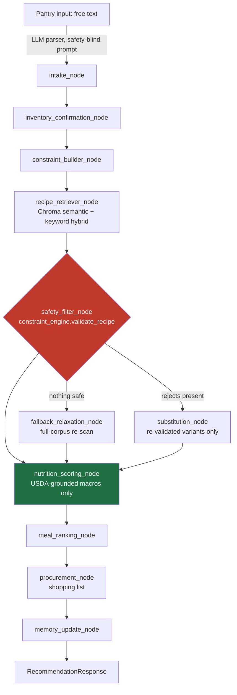

# MacroChef

**An AI meal-planning agent where the LLM is never trusted with safety.**

MacroChef turns a text list of what's in your kitchen into allergy-safe,
macro-targeted meal recommendations and day/week meal plans. It's built around one
non-negotiable architectural rule: **the language model never decides whether a
recipe is safe, and it never computes nutrition.** Every allergy check, diet
filter, and macro number comes from deterministic, tested, citation-backed Python.
The LLM only does the fuzzy, reversible parts — parsing free-text pantry input,
phrasing a cooking step, tagging a recipe's cuisine — and every one of its
outputs is re-validated by the same deterministic code, or explicitly labeled
as a fuzzy guess, before it can reach a user.

[**Live demo →**](https://ca-macrochef.orangeplant-d8bf2180.italynorth.azurecontainerapps.io/)
&nbsp;·&nbsp;
[API docs](https://ca-macrochef.orangeplant-d8bf2180.italynorth.azurecontainerapps.io/docs)
&nbsp;·&nbsp;
Backend: FastAPI + LangGraph &nbsp;·&nbsp; Frontend: React 19 + TypeScript &nbsp;·&nbsp; Deploy: Azure Container Apps


<!-- TODO(human): capture a 15–20s screen recording of the recommend → day-plan
flow and drop it here as docs/media/demo.gif, then replace this comment with:
 -->

---

## What it does

1. **Tell it what's in your kitchen** — type a free-text pantry list. An
   LLM parses it into structured ingredients; it is explicitly prompted to
   never infer allergens, nutrition, or safety — that's not its job.
2. **Set your constraints** — allergies, dietary type, disliked ingredients,
   macro targets, cook-time budget, cuisine preference.
3. **Get recommendations that are *provably* safe for your profile** — every
   candidate recipe is run through a deterministic constraint engine before
   it can be ranked or shown. Recipes that fail can be auto-substituted and
   re-validated, or explained in a rejection list — never silently dropped.
4. **See macros you can trust** — nutrition is computed from ingredient
   grams grounded against USDA FoodData Central, not from a recipe's
   self-reported (and frequently wrong) tag metadata.
5. **Plan a day, a week, or a batch** — a from-scratch combinatorial solver
   assembles meal combinations that hit your macro targets, with a strict,
   auditable tiebreak order (never a fuzzy "optimization").

## The core design decision

> Anything that could harm a user if wrong is deterministic. The LLM is only
> used for fuzzy, non-safety-critical work — parsing intent, ranking,
> phrasing, tagging.

This isn't a comment in a docstring — it's enforced structurally:

- The benchmark's judge and the production safety code are prevented from
  ever importing each other, checked by an **AST-walking test**
  (`tests/test_safety_judge_import_ban.py`) so a shared blind spot can't
  hide behind a passing test suite.
- LLM-generated recipe candidates (from the recipe discovery feature) are
  never trusted directly — every one is re-validated and has its allergen
  labels *re-derived* from its actual ingredient list before it can be saved.
- A recipe's self-reported `diet_tags` are stored but **never used to admit
  or reject** a recipe — only a live ingredient scan decides. (An early
  version trusted tags and a documented adjudication case proved that let
  an unsafe recipe through; the fix is now a standing rule.)
- Even a purely cosmetic field like a recipe's cuisine tag follows the same
  discipline: every value — hand-curated, deterministically mined, or
  LLM-inferred — carries an explicit provenance tag (`declared` /
  `recovered_tag` / `gazetteer_matched` / `llm_inferred` / `human_corrected`)
  so a display-only guess is never confused with a verified fact, and
  nothing downstream of it can accidentally start trusting an LLM's opinion
  as ground truth.

## Architecture



Built on **LangGraph** (`app/graph/`) with a hand-written sequential fallback
that preserves identical node order if the LangGraph import ever fails — the
pipeline degrades gracefully, it doesn't break. Every node's input/output is
a validated **Pydantic v2** model (`app/schemas/`), including the shared
graph state — no untyped dicts crossing node boundaries.

A second, independent LangGraph workflow (`app/graph/library_builder.py`)
handles recipe discovery: an LLM proposes candidate recipes, but every
candidate is normalized, deduplicated, and pushed back through the exact
same `validate_recipe` + `derive_allergen_labels` primitives before it's
allowed into the library.

The LLM touches exactly three surfaces in the whole system — free-text
pantry parsing, optional recipe-instruction rewriting, and offline
cuisine/meal-type tagging for corpus rows a deterministic pass genuinely
can't reach — all three explicitly prompted to never add, remove, or
substitute ingredients or make a nutrition/allergen claim, with a
deterministic fallback (or an honest "unknown") if the model's output looks
unsafe, malformed, or merely unconfident. (A vision-based fridge-photo
intake path exists in the backend but is currently feature-flagged off and
has no frontend entry point yet.) A small provider-chain abstraction
(`app/services/model_provider.py`) routes between Gemini, OpenAI, Anthropic,
and a local Ollama backend with automatic fallback, ending in a mock
provider so tests and CI never touch a paid API.

## Engineering deep dives

### 1. Deterministic safety engine

`app/services/constraint_engine.py` is the sole authority for allergy and
diet decisions — everything else in the system, including the LLM, is
downstream of it.

- **Allergen vocabularies are composed, not duplicated.** Base sets
  (`_FISH`, `_CRUSTACEAN`, `_DAIRY`, `_TREE_NUT`, …) are `frozenset`s;
  aliases like `"seafood"` or `"nuts"` are built as *unions* of those sets,
  so two labels that must agree structurally can't drift apart from a
  missed hand-edit — a documented past bug class this was built to close
  off permanently.
- **Direction-aware substring matching.** An allergen term matches only if
  it appears *inside* a longer ingredient name, never the reverse — so a
  recipe containing "soy sauce" correctly matches a soy allergy, but a
  "pepper" allergy never spuriously matches "pepperoni."
- **Lookalike exclusions, evaluated pairwise.** Carve-outs like "water
  chestnut" (not a tree nut) or "bean curd" (tofu, not dairy) are checked
  per ingredient-term pair, not per recipe — so a real allergen elsewhere
  in the same recipe can never hide behind an unrelated lookalike.
- **Fail-closed on ambiguity.** Every vocabulary addition is commented with
  its regulatory source (FALCPA, EU 1169/2011, FARE) and a measured
  over-block cost against the recipe corpus, so the safety/precision
  trade-off is a documented decision, not a guess. This isn't theoretical:
  the adversarial benchmark below has twice caught a real gap this way
  (a packaged product like hollandaise sauce or a branded candy bar
  carrying an allergen a substitution missed) — each one closed the same
  way, with a citable source, a corpus-wide regression check proving zero
  previously-correct detections broke, and a second, independent review
  before the fix shipped.

### 2. Adversarial safety benchmark

`scripts/run_safety_benchmark.py` evaluates the deterministic safety layer
against **381 hand-authored adversarial cases** (hidden allergens, "stated
then contradicted" constraints, prompt-injection attempts, diet traps,
morphology confusions like "eggplant" vs. "egg", plus recipe-substitution
attacks) — split into a **269-case release-blocking set** and smaller
precautionary/safe-control sets, with the split pre-registered *before* any
score existed so it can't be quietly redefined to fit a result.

Design choices worth calling out:

- **The judge is deliberately dumber and more paranoid than production** —
  a simple, recall-biased substring matcher, kept structurally unable to
  import the code it's grading (enforced by an AST-based test, not a
  convention). A false positive costs a few minutes of manual review; a
  false negative would let the benchmark quietly lie about safety.
- **Blind authoring.** Case authors were barred from reading the
  constraint-engine source; every forbidden-term list must trace to an
  external citation (FARE, FDA FALCPA, 21 CFR, The Vegan Society) — a
  direct fix after an earlier retrieval eval that derived its own ground
  truth from the code under test and silently inflated its results.
- **Statistics built for a safety gate, not a demo.** Each case set runs
  **3 times**; the release-blocking number is the **worst of the three
  runs** with a **Wilson 95% confidence interval**, not a friendlier mean.
- **A hard-coded spend gate.** The benchmark forces a mock LLM provider and
  strips provider API keys at import time; a real-provider run requires an
  explicit `--confirm-real-provider-spend` flag and prints a cost estimate
  first.
- **Every flag gets adjudicated against the real code, not a sample.**
  `scripts/verify_benchmark_evidence.py` re-runs the actual production
  `contains_allergen`/`violates_diet_type` functions directly against every
  served recipe's real ingredient list for every flagged case — an
  exhaustive check, not a manually-classified sample — after an earlier,
  hand-written adjudication pass was independently reviewed and found to
  have mischaracterized its own sampling. The full adjudication trail
  lives in `data/evaluation/`.

**Current numbers** (both reported together, as the methodology requires —
the raw judge count is never hidden behind the adjudicated one):

| Metric | Result |
|---|---|
| Judge-flagged, inherent (release-blocking) | **73 / 269** (27.1%, Wilson 95% CI 22.2–32.7%) |
| Adjudicated-true violations | **0 / 269** — every flag traced, with cited evidence and an exhaustive run of the actual production safety code against every served ingredient list, to a known judge-matching artifact, not to the production constraint engine |
| Safe-control false-positive rate | **0 / 60** |

The judge is never modified to close this gap — every future run is
adjudicated the same way, and the raw and adjudicated numbers are both
published every time. See `data/evaluation/` for the run this table came
from and every case's written adjudication.

### 3. USDA-grounded nutrition

`app/services/usda_client.py` and `nutrition_grounding.py` convert each
ingredient to grams and look it up against USDA FoodData Central rather
than trusting a recipe's self-reported macros:

- A **relevance gate** blocks near-miss matches (a bare "avocado" query
  matching "avocado oil"; "bell pepper" matching "Taco Bell Nachos").
- **Preparation-aware matching** (raw / cooked / canned) avoids a ~2–3×
  calorie error from matching a cooked ingredient to a raw FDC record.
- A **plausibility gate** checks calorie bounds and Atwater-factor
  consistency (4/4/9 kcal per gram of protein/carb/fat) before a match is
  accepted.
- Every recipe's nutrition carries an explicit trust state —
  `GROUNDED` / `PARTIAL` / `UNGROUNDED` — and a single chokepoint function,
  `trusted_per_serving()`, is the *only* thing the ranker, the planner, and
  the frontend's trust badge are allowed to read. Partially-grounded or
  flagged-implausible results are treated as absent, never silently
  averaged in.
- **The tracked metric is the one that's actually load-bearing, not the
  convenient one.** "Does this ingredient have a unit string?" looked like
  the right thing to optimize — until a direct measurement
  (`scripts/measure_grams_computable.py`) showed only ~36% of ingredient
  rows were actually convertible to grams, because the real bottleneck was
  two small, hand-cited conversion tables, not missing unit text. Expanding
  those tables (every entry backed by a USDA household-measure weight or an
  equivalent named source — never a guessed number) raised real
  gram-computability from 36% to **53%**, while the surface "unit present"
  metric barely moved. The lesson generalizes past this one metric: measure
  what the system actually does with the data, not a proxy for it.

### 4. A solver, sized to the data it actually has

`app/services/day_planner.py` assembles day/week/batch meal plans by
**exhaustively enumerating** multiset combinations of the fully macro-grounded
recipe pool (capped per-recipe reuse), rather than reaching for an off-the-shelf
solver. That's a measured decision, not a shortcut: only a small fraction of
the corpus is currently *fully* macro-grounded, so brute-force enumeration is
both provably optimal and fast at the current scale — with a pre-registered
trigger (~200 grounded recipes) for when the enumeration should be swapped
for a proper solver, and the code already structured so that's a
single-function change.

Plan selection uses a **strict, lexicographic tiebreak order** — never a
blended score:

1. within macro tolerance (kcal ±10%, protein ±15%) beats out-of-tolerance, always
2. lower calorie error
3. lower protein error
4. meal variety (fewer repeated recipes across the week)
5. pantry-ingredient coverage

Tiers 4–5 only ever break an *exact* tie on the macro tiers above them — they
are explicitly never allowed to trade away macro fit for variety or pantry
convenience.

### 5. Retrieval, evaluated like a search system

Recipe retrieval (`app/rag/`) blends semantic search (ChromaDB +
`sentence-transformers/all-MiniLM-L6-v2`) with keyword matching, and it's
evaluated the same way a production search system would be: **67 pinned
queries** across categories (dish name, dietary intent, cuisine, meal type,
paraphrase robustness), scored with **recall@k, MRR, and nDCG@k**, against a
**pre-registered pass/fail gate** rather than an eyeballed "looks better."
Latest run: semantic retrieval beats keyword search on both gated categories
— dish-name MRR 1.00 vs. 0.63, dietary-intent MRR 0.09 vs. 0.00 —
**gate: PASS**.

The production hybrid path (`RecipeRetriever.retrieve()`) itself has a
worked example of the "measure, don't assume" discipline above: it used to
apply cuisine/meal-type as a hard database filter, which — combined with
how little of the corpus carried a cuisine tag at the time — meant picking
almost any cuisine returned results from a handful of recipes, regardless of
what the other thousands actually were. Fixed by routing that signal
through a soft-scoring boost instead of a hard exclusion, verified with a
regression test that reproduces the failure against the old code path.

### 6. Corpus data engineering: mine before you infer

The recipe corpus (10,011 recipes, Food.com CC0-licensed base + an
in-house scraper for the top-up to 10k) shipped with almost no cuisine or
meal-type metadata, and a meaningful share of ingredient rows had a
messy or missing unit. Closing that gap followed a strict, deterministic-
first waterfall — never reach for a model until cheaper, fully-auditable
methods are provably exhausted:

1. **Fix the parser, not the data.** Two real bugs in the quantity parser
   (a fraction-range regex gap, container words like "can"/"package"
   leaking into the ingredient name) were corrupting ~2,000 rows before
   they ever reached the USDA lookup. Fixed at the source, with a
   corpus-wide before/after regression diff proving zero previously-correct
   allergen detections changed — because ingredient text also feeds the
   safety engine, any change to it gets the same regression discipline as
   a safety fix, even though this one wasn't.
2. **Mine what the source already knows.** The scraped data carried a
   structured tag field that was already being read for barely anything —
   extending the mapping (matched only against structured tags, never
   fuzzy-matched against free text, to avoid mistagging "French Toast" as
   French cuisine) recovered real signal for free.
3. **A narrow, adversarially-tested gazetteer for what mining can't reach.**
   Some real cuisines (American, Italian, French…) are systematically
   *never* tagged by the source data, for a human reason: nobody labels a
   dish "American" on a US recipe site. A small dish-name gazetteer
   ("coq au vin" → French, "carbonara" → Italian) closes part of that gap —
   shipped with a mandatory adversarial test suite asserting it does *not*
   fire on the exact collision cases that would make this unsafe to ship
   ("French Toast", "Swiss Cheese", "Russian Dressing").
4. **Only then, a scoped, abstain-biased classification pass** for the
   residual that no deterministic method could reach — explicitly held to
   an "unknown beats a wrong guess" posture (a wrong tag doesn't just fail
   to help, it hides a correct recipe from a filtered search and surfaces a
   wrong one), evaluated against a pre-registered held-out sample before
   being trusted, and every single output stamped with a provenance tag
   distinguishing it from ground truth.

Result: cuisine coverage 0.25% → 51.8%, meal-type coverage 14.8% → 85.9%,
real gram-computability 36% → 53% — with every recipe's tag traceable to
exactly which of the four tiers produced it.

## Tech stack

| Layer | Choices |
|---|---|
| **Agent orchestration** | LangGraph (with a sequential fallback), Pydantic v2 contracts on every node boundary |
| **LLM providers** | Gemini (default), OpenAI, Anthropic, local Ollama — chained with automatic fallback, ending in a mock provider for tests/CI |
| **Retrieval** | ChromaDB + sentence-transformers embeddings, hybrid semantic/keyword search, formal IR evaluation harness |
| **Backend** | FastAPI, SQLAlchemy 2.x (typed models), PostgreSQL (Neon) in production / SQLite locally |
| **Frontend** | React 19, TypeScript, Vite, TanStack Query, Tailwind CSS v4 — types generated from the backend's own OpenAPI schema |
| **Auth & security** | Signed, cookie-based anonymous sessions (`itsdangerous`), custom-header CSRF proof, fail-closed startup checks, per-endpoint rate limiting |
| **Infrastructure** | Single-process Docker image (multi-stage: Node build → Python runtime, embedding model and vector index baked in at build time), Azure Container Apps, Azure Container Registry with managed-identity auth |
| **CI/CD** | GitHub Actions — tests + lint + typecheck + build on every push; production deploy is a separate, explicitly human-triggered workflow step |
| **Observability** | PostHog product analytics (silently no-ops without a key, so CI never phones home) |

## Quality bar

- **1,573 tests** across 76 files — constraint engine, the safety judge's
  import-ban, corpus import/quarantine integrity, retrieval metrics,
  nutrition grounding, both LangGraph flows, all three planners, session
  auth, rate limiting, and a benchmark **mutation self-check** (a fault is
  deliberately planted to confirm the benchmark actually goes non-zero).
- **CI gate on every push**: `pytest` plus a dedicated diet-leak audit
  script, and a full lint/typecheck/build pass on the frontend.
- **Deploys are a human action, not a side effect** of pushing to `main` —
  CI builds and tests automatically; shipping to Azure is a separate,
  explicit trigger.

## Known limitations — stated plainly

- This is not medical advice, and the app says so. Nutrition estimates
  depend on ingredient-level grounding quality; allergy safety depends on
  the deterministic engine's vocabulary and on accurate user input — always
  verify ingredients yourself if you have a food allergy.
- A vision-based fridge-photo intake path exists in the backend but is
  feature-flagged off with no frontend entry point yet.
- The multi-provider LLM router defaults to a deterministic mock outside a
  configured key, by design, so the app and CI never require a paid API to
  run — but that also means the fuzzy-parsing quality you see locally
  without a key differs from a real provider.
- Nutrition grounding, cuisine tagging, and unit conversion are all
  honestly partial and labeled as such (`GROUNDED`/`PARTIAL`/`UNGROUNDED`;
  explicit tag-provenance fields) rather than silently rounded up to 100%.

## Skills demonstrated

- **Agentic system design** — two independent LangGraph state machines with
  typed node contracts, conditional edges, and a hand-rolled fallback path.
- **Safety-critical system architecture** — a hard separation between
  fuzzy (LLM) and authoritative (deterministic) decisions, enforced by a
  static-analysis test, not a convention.
- **Rigorous ML/NLP evaluation practice** — pre-registered pass/fail gates,
  worst-of-N with confidence intervals, blind case authoring, held-out
  self-checks, and negative results reported rather than hidden. Every
  metric answers "load-bearing for what?" before it's optimized.
- **RAG systems** — ChromaDB + sentence-transformer embeddings, hybrid
  semantic/keyword retrieval, evaluated with recall/MRR/nDCG against a
  frozen ground-truth set, not eyeballed.
- **Data engineering** — a multi-stage, provenance-tracked corpus pipeline
  (import → quarantine → USDA grounding → deterministic tagging → scoped
  LLM classification only where deterministic methods provably can't reach)
  with corpus-wide regression checks on every ingredient-touching change.
- **Full-stack delivery** — FastAPI + React/TypeScript with a shared,
  generated API contract; CI/CD to a containerized cloud deploy with a
  deliberate human gate before anything reaches production.
- **Multi-provider LLM integration** — a provider-chain abstraction across
  Gemini/OpenAI/Anthropic/local Ollama with automatic fallback and a
  zero-cost mock path for tests and CI.

## Running locally

```bash
# backend
uvicorn app.main:app --reload --port 8000

# frontend (separate terminal — Vite dev server proxies API calls to :8000)
cd web && npm run dev
```

```bash
pytest                                  # test suite
python scripts/evaluate_demo_set.py     # deterministic-metrics demo eval
python scripts/run_safety_benchmark.py  # adversarial safety benchmark (mock provider by default)
```

For a production-parity smoke test of the single-process image:

```bash
docker compose up --build
```

Copy `.env.example` to `.env` and fill in your own keys (LLM provider,
USDA FoodData Central, database URL, session secret) — no key ever ships
in this repository.

## Project layout

```
app/
  graph/        LangGraph state machines (recommendation + library builder)
  services/      constraint_engine, nutrition grounding, planners, ranking, retrieval
  schemas/       Pydantic contracts for every agent/API boundary
  api/           FastAPI routers
  data/          SQLAlchemy models
  evaluation/    safety benchmark, retrieval metrics, demo-set metrics
web/             React + TypeScript SPA
scripts/         benchmark runner, corpus import, USDA grounding job, demo eval
data/evaluation/ every safety-benchmark run and its written adjudication
docs/DEPLOY.md   the deploy runbook — what's automated, what's a human gate, and why
```

---

MIT licensed. This is an independent project, not a medical or nutrition
service — always verify ingredients yourself if you have a food allergy.
