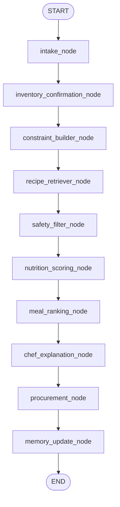

# MacroChef Agent


> **Hobby project — not medical advice.** MacroChef is an unpaid personal project,
> not a certified nutrition or allergy-safety product. Its adversarial safety
> benchmark (371 cases, see below) **has been run**, and the current
> adjudicated-true inherent violation count is **nonzero** — deployment is
> blocked until it reaches zero. No violation-rate claim is made anywhere in
> this README; the release gate is zero adjudicated-true inherent violations,
> with the raw judge-flagged count always published alongside it. **If you have
> a food allergy, you must independently verify every ingredient before you eat
> anything this app suggests.**

**A deterministic meal-planning and food-safety engine that uses an LLM only for the fuzzy parts.**

> **The LLM never enforces your allergies and never computes your macros.
> Deterministic code does.** The model is used only for non-safety-critical work —
> parsing messy inventory text, ranking, and phrasing explanations. Anything that
> could harm you if it were wrong is handled by plain, testable Python.

Generic recipe chatbots are confident and wrong about hard constraints — they'll
happily suggest a peanut-containing "satay" to someone who told them they have a
peanut allergy. MacroChef treats meal planning as a structured decision workflow
where safety and nutrition are **not** the model's job.

> Runs with **zero API keys** in mock mode — clone and try in two commands.

---

## Why this is different

| Concern | Who decides in a generic LLM chatbot | Who decides in MacroChef |
|---|---|---|
| Is this recipe safe for my allergy? | The LLM (fuzzy, can hallucinate) | **Deterministic code** — `app/services/constraint_engine.py` |
| What are the macros? | The LLM / recipe self-reported tags | **Deterministic scorer** — `app/services/nutrition_scorer.py` |
| Which recipes match my pantry & diet? | The LLM | **Deterministic filter + scorer** |
| Parse "chikcen brest, spinch" into ingredients | — | LLM / fuzzy normalizer (safe to be wrong; user confirms) |
| Rank and explain the shortlist | — | LLM (phrasing only) |

Allergies, disliked ingredients, diet type, and maximum cook time are enforced as
**hard constraints** in `constraint_engine.py`. Macro fit is computed
deterministically by the scorer. The LLM cannot override a safety decision — by
construction, not by prompt. Macro targets are *soft* constraints used only to
rank, never to include or exclude on safety grounds.

> A reproducible adversarial safety benchmark (371 cases: allergy-contradiction
> traps, hidden allergens like "satay sauce" → peanut, diet-type traps, and more)
> has been authored and **is now being run against MacroChef**. The current
> adjudicated-true inherent violation count is **nonzero**, so deployment is
> blocked and **no violation-rate number is published anywhere in this README**
> until the release gate (zero adjudicated-true inherent violations, with the
> raw judge-flagged count always published alongside) is met. The planned
> comparison vs. direct LLM prompting is deferred until then. See
> `docs/ROADMAP.md`.

---

## Quickstart

Requires Python 3.11+.

```bash
# 1. Clone
git clone https://github.com/Dipesh-Lc/macroChef-agent.git
cd macroChef-agent

# 2. Install
python -m venv .venv
source .venv/bin/activate            # Windows: .venv\Scripts\activate
pip install -r requirements.txt

# 3. Configure (mock mode — no API keys needed)
cp .env.example .env

# 4. Build the recipe index (full grounded corpus: 25 curated seeds +
#    imported Food.com recipes, ~4,200+ recipes)
python scripts/ingest_recipes.py

# 5. Run the API and the UI (two terminals)
uvicorn app.main:app --reload --port 8000
streamlit run frontend/streamlit_app.py
```

Then open **http://localhost:8501**.

The default `.env` uses mock/local mode and requires no external API keys.

### One-command local run (Docker)

If you have Docker, skip the manual steps — this starts both the API and the
Streamlit UI:

```bash
docker compose up --build
```

- API: http://localhost:8000  (health check: `GET /health`)
- UI:  http://localhost:8501

Deploying the API to Azure Container Apps is automated (CI/CD, manual
production trigger) — see `docs/DEPLOY.md`.

---

## Screenshots & demo

> **TODO:** Add screenshots to `assets/screenshots/` and a demo clip, then replace the placeholders below.

- **TODO** `assets/screenshots/recommendations.png` — recommendation cards with scores and shopping list
- **TODO** `assets/screenshots/inventory.png` — inventory extraction / confirmation view
- **TODO** `assets/screenshots/library.png` — Recipe Library Builder
- **TODO** demo GIF/clip (60–90s) — end-to-end: pantry in → safe, macro-aware plan out

---

## How it works

MacroChef is a LangGraph workflow. Each node has structured Pydantic v2
inputs/outputs, and the safety-critical nodes are pure deterministic code.



The graph handles conditional paths for empty inventory, low-confidence vision
items, retrieval fallback when ChromaDB is unavailable, and no valid recipes
surviving the safety filter.

### Architecture

```text
Streamlit UI
   |
   v
FastAPI routes
   |
   v
LangGraph workflow
   |--> inventory parser (+ optional fuzzy normalization)
   |--> inventory confirmation
   |--> constraint builder
   |--> ChromaDB recipe retriever + keyword fallback
   |--> deterministic safety filter        <-- LLM never touches this
   |--> deterministic nutrition & pantry scoring  <-- LLM never touches this
   |--> ranking and explanation (LLM phrasing only)
   |--> shopping list generation
   |--> SQLite memory
```

### RAG design

`scripts/ingest_recipes.py` does a clean rebuild of the full recipe corpus
(`data/processed/sample_recipes.jsonl` + `data/processed/imported_recipes.jsonl`,
grounded against USDA FoodData Central), builds a rich recipe document per
recipe, stores recipe metadata, and persists the Chroma collection in
`data/chroma`. Local sentence-transformers embeddings are attempted first; a
deterministic hashing-embedding fallback keeps offline demos runnable.

Beyond the 25 hand-curated seed recipes, the corpus also includes recipes
imported via `scripts/import_corpus.py` into `data/processed/imported_recipes.jsonl`
(kept separate from the seed file, unioned at index time). Recipe data derived
from a public Kaggle dataset sourced from Food.com
([irkaal/foodcom-recipes-and-reviews](https://www.kaggle.com/datasets/irkaal/foodcom-recipes-and-reviews),
CC0).

---

## Features

- Text inventory parsing with optional fuzzy ingredient normalization
  (`chikcen brest` → `chicken breast` when `rapidfuzz` is installed)
- ChromaDB RAG over a bundled 25-recipe JSONL corpus
- LangGraph nodes for intake, inventory confirmation, constraints, retrieval,
  safety filtering, scoring, ranking, explanation, procurement, and memory
- **Deterministic** hard constraints for allergies, dislikes, diet type, and cook time
- **Deterministic** macro scoring
- Separate Recipe Library Builder Agent for discovering, validating, saving, and
  indexing personal recipes
- Structured Pydantic v2 API contracts
- SQLite user-feedback memory
- Streamlit frontend with recipe cards, scores, shopping list, and debug trace
- Pytest coverage for parsing, constraints, scoring, retrieval, and graph flow

### Optional / experimental: fridge-photo (vision) inventory

The feature is **off by default** and gated by `MACROCHEF_ENABLE_VISION` (set to
`true` in your `.env` to enable it). Even when enabled, extraction is
deterministic mock unless a real `MODEL_PROVIDER` with credentials is also
configured (see *Optional model providers* below).

When enabled, the frontend accepts an optional fridge/pantry image alongside typed
inventory and merges both into one editable table. Vision is intentionally isolated:
it never influences allergy or nutrition decisions, and detected items are surfaced
for user confirmation (anything below a confidence threshold is flagged
`needs_confirmation`). Treat it as experimental.

---

## Recipe Library Builder Agent

The Recipe Library Builder is a separate acquisition workflow. The meal planner
answers "Given my pantry and constraints, what should I cook?" The library builder
answers "Help me build a personalized recipe database."

```text
Streamlit Library Page
  -> POST /library/discover  -> discovery_node -> normalization_node
  -> recipe_validation_node  -> deduplication_node -> candidate_presentation_node
  -> POST /library/save      -> SQLite structured recipe store -> ChromaDB index
```

Users choose cuisines, meal type, diet type, cook time, difficulty, allergy
exclusions, and preferences such as "minimal equipment" or "no deep frying."
Candidate recipes are validated and deduplicated before they can be saved. Saved
recipes store `owner_user_id`, `is_user_saved`, source metadata, placeholder image
URLs, estimated macros, and allergen tags. The recommendation workflow retrieves
from both the base corpus and the current user's saved library; private recipes
are filtered by `user_id` so one user's recipes are never returned for another.

Recipe Library API endpoints:

- `POST /library/discover` — generate or retrieve candidate recipes
- `POST /library/save` — save selected validated candidates
- `GET /library/{user_id}` — list saved recipes
- `DELETE /library/{user_id}/{recipe_id}` — deactivate a saved recipe
- `POST /library/reindex` — rebuild Chroma from base and user recipes

---

## Optional model providers

Mock mode is the default and needs no keys. If you provide API keys or run Ollama
locally, MacroChef can use hosted or local models for the fuzzy work only (image
inventory extraction and explanation phrasing) — never for safety or nutrition.

Supported provider names:

- `mock` — deterministic demo mode, no API key
- `gemini` / `google` — Gemini API via `GEMINI_API_KEY` or `GOOGLE_API_KEY`
- `openai` — OpenAI API via `OPENAI_API_KEY`
- `anthropic` / `claude` — Claude API via `ANTHROPIC_API_KEY` or `CLAUDE_API_KEY`
- `ollama` / `local` — local Ollama server via `OLLAMA_BASE_URL`

`MODEL_PROVIDER` is the primary provider; `MODEL_PROVIDER_FALLBACKS` is an ordered
comma-separated list. If the primary provider is missing credentials, unavailable,
or returns invalid output, MacroChef tries each fallback and finally falls back to
`mock`, so the app always stays runnable. See `.env.example` for every supported
key.

---

## Example request

```bash
curl -X POST http://localhost:8000/recipes/recommend \
  -H "Content-Type: application/json" \
  -d '{
    "user_id": "demo_user",
    "input_type": "text",
    "typed_ingredients": "chicken breast, spinach, rice",
    "user_profile": {
      "user_id": "demo_user",
      "allergies": ["peanut"],
      "disliked_ingredients": [],
      "diet_type": null,
      "preferred_cuisines": ["Mediterranean"],
      "macro_targets": {
        "calories": 600, "protein_g": 45, "carbs_g": 60, "fat_g": 20, "fiber_g": 8
      },
      "max_cook_time_min": 35
    },
    "cuisine_preference": "Mediterranean",
    "meal_type": "dinner"
  }'
```

<details>
<summary>Windows PowerShell version</summary>

```powershell
$body = @'
{
  "user_id": "demo_user",
  "input_type": "text",
  "typed_ingredients": "chicken breast, spinach, rice",
  "user_profile": {
    "user_id": "demo_user",
    "allergies": ["peanut"],
    "disliked_ingredients": [],
    "diet_type": null,
    "preferred_cuisines": ["Mediterranean"],
    "macro_targets": { "calories": 600, "protein_g": 45, "carbs_g": 60, "fat_g": 20, "fiber_g": 8 },
    "max_cook_time_min": 35
  },
  "cuisine_preference": "Mediterranean",
  "meal_type": "dinner"
}
'@

Invoke-RestMethod -Uri "http://localhost:8000/recipes/recommend" -Method Post -ContentType "application/json" -Body $body
```

</details>

### Example response shape

```json
{
  "recommendations": [
    {
      "recipe": {"recipe_id": "r_001", "title": "Mediterranean Chicken Rice Bowl"},
      "score": {
        "pantry_match_score": 0.5,
        "macro_fit_score": 0.91,
        "final_score": 0.72,
        "missing_ingredients": ["bell pepper", "Greek yogurt", "lemon"]
      },
      "explanation": "This recipe fits because...",
      "shopping_list": ["bell pepper", "Greek yogurt", "lemon"]
    }
  ],
  "shopping_list": [{"name": "bell pepper", "reason": "Needed for ..."}],
  "rejected_recipes": [],
  "debug_trace": ["intake_node: extracted 3 ingredients.", "..."]
}
```

---

## Evaluation

Deterministic metrics computed over a small internal demo set (not the
adversarial safety benchmark — see the disclaimer at the top of this README):

- Allergy violation rate (release-blocking gate: must be 0 on this demo set)
- Pantry utilization rate
- Macro deviation
- Missing ingredient count
- Recommendation validity rate

```bash
python scripts/evaluate_demo_set.py
```

## Tests

```bash
pytest
```

## Tech stack

- Backend: FastAPI, Pydantic v2, Uvicorn, SQLAlchemy, SQLite
- Frontend: Streamlit, Requests, Pandas
- Agent: LangGraph
- RAG: ChromaDB, sentence-transformers, deterministic embedding fallback
- Optional AI providers: Gemini, OpenAI, Claude, local Ollama
- Testing: Pytest — Packaging: Docker, docker-compose

## Limitations

- Not medical advice.
- Nutrition is grounded via USDA FoodData Central for the 25 hand-authored seed
  recipes; imported-corpus rows remain ungrounded and unit-less (see below).
- The bundled recipe dataset is intentionally small for an MVP.
- Vision extraction is deterministic mock by default and is not a real image
  recognizer.
- Allergy safety depends on accurate recipe metadata and accurate user input.
- Optional hosted/local model integrations are isolated and disabled by default,
  and are never treated as allergy or nutrition authorities.
- **Imported corpus quantities have no units.** All but 122 of the ~33,732
  imported Food.com ingredient rows carry no unit (verified 2026-07-17) — the
  upstream dataset strips them. Imported recipes are therefore
  discovery/inspiration; quantity-aware features (pantry-match amounts,
  shopping-list math, future cost estimation) are real only for the 25
  hand-authored seed recipes and user-entered pantry items. Allergen detection
  is name-based and unaffected.
- **Identity is anonymous and per-browser.** Sessions are signed anonymous
  tokens — no email, no login (a deliberate scope decision: no PII in a hobby
  demo). Clearing cookies or switching devices starts a fresh library; tokens
  expire after 30 days and the old library is then unreachable. Session
  isolation itself is enforced and tested (tampered/forged/expired tokens get
  401). Durable cross-device identity (magic-link) is a possible post-launch
  addition.

## Roadmap

MacroChef is being upgraded in phases toward a grounded nutrition database,
quantity/unit-aware inventory, a published safety benchmark, and a weekly meal
planner. See `docs/ROADMAP.md`.
