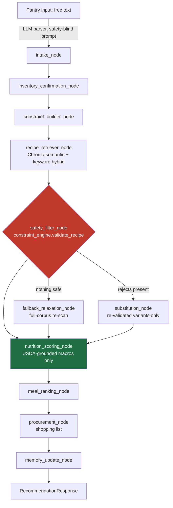

# MacroChef

**An AI meal-planning agent where the LLM is never trusted with safety.**

MacroChef turns a text list of what's in your kitchen into allergy-safe,
macro-targeted meal recommendations and day/week meal plans. It's built around one
non-negotiable architectural rule: **the language model never decides whether a
recipe is safe, and it never computes nutrition.** Every allergy check, diet
filter, and macro number comes from deterministic, tested, citation-backed Python.
The LLM only does the fuzzy, reversible parts — parsing free-text pantry input,
phrasing a cooking step — and every one of its outputs is re-validated by the same
deterministic code before it can reach a user.

[**Live demo →**](https://ca-macrochef.orangeplant-d8bf2180.italynorth.azurecontainerapps.io/)
&nbsp;·&nbsp;
[API docs](https://ca-macrochef.orangeplant-d8bf2180.italynorth.azurecontainerapps.io/docs)
&nbsp;·&nbsp;
Backend: FastAPI + LangGraph &nbsp;·&nbsp; Frontend: React 19 + TypeScript &nbsp;·&nbsp; Deploy: Azure Container Apps


<!-- TODO(human): capture a 15–20s screen recording of the recommend → day-plan
flow and drop it here as docs/media/demo.gif, then replace this comment with:
 -->

---

## What it does

1. **Tell it what's in your kitchen** — type a free-text pantry list. An
   LLM parses it into structured ingredients; it is explicitly prompted to
   never infer allergens, nutrition, or safety — that's not its job.
2. **Set your constraints** — allergies, dietary type, disliked ingredients,
   macro targets, cook-time budget, cuisine preference.
3. **Get recommendations that are *provably* safe for your profile** — every
   candidate recipe is run through a deterministic constraint engine before
   it can be ranked or shown. Recipes that fail can be auto-substituted and
   re-validated, or explained in a rejection list — never silently dropped.
4. **See macros you can trust** — nutrition is computed from ingredient
   grams grounded against USDA FoodData Central, not from a recipe's
   self-reported (and frequently wrong) tag metadata.
5. **Plan a day, a week, or a batch** — a from-scratch combinatorial solver
   assembles meal combinations that hit your macro targets, with a strict,
   auditable tiebreak order (never a fuzzy "optimization").

## The core design decision

> Anything that could harm a user if wrong is deterministic. The LLM is only
> used for fuzzy, non-safety-critical work — parsing intent, ranking,
> phrasing.

This isn't a comment in a docstring — it's enforced structurally:

- The benchmark's judge and the production safety code are prevented from
  ever importing each other, checked by an **AST-walking test**
  (`tests/test_safety_judge_import_ban.py`) so a shared blind spot can't
  hide behind a passing test suite.
- LLM-generated recipe candidates (from the recipe discovery feature) are
  never trusted directly — every one is re-validated and has its allergen
  labels *re-derived* from its actual ingredient list before it can be saved.
- A recipe's self-reported `diet_tags` are stored but **never used to admit
  or reject** a recipe — only a live ingredient scan decides. (An early
  version trusted tags and a documented adjudication case proved that let
  an unsafe recipe through; the fix is now a standing rule.)

## Architecture



Built on **LangGraph** (`app/graph/`) with a hand-written sequential fallback
that preserves identical node order if the LangGraph import ever fails — the
pipeline degrades gracefully, it doesn't break. Every node's input/output is
a validated **Pydantic v2** model (`app/schemas/`), including the shared
graph state — no untyped dicts crossing node boundaries.

A second, independent LangGraph workflow (`app/graph/library_builder.py`)
handles recipe discovery: an LLM proposes candidate recipes, but every
candidate is normalized, deduplicated, and pushed back through the exact
same `validate_recipe` + `derive_allergen_labels` primitives before it's
allowed into the library.

The LLM touches exactly two surfaces in the main flow — free-text pantry
parsing and optional recipe-instruction rewriting — both explicitly
prompted to never add, remove, or substitute ingredients or make a
nutrition/allergen claim, with a deterministic fallback to the original text
if the model output looks unsafe or malformed. (A vision-based fridge-photo
intake path exists in the backend but is currently feature-flagged off and
has no frontend entry point yet.) A small provider-chain abstraction
(`app/services/model_provider.py`) routes between Gemini, OpenAI, Anthropic,
and a local Ollama backend with automatic fallback, ending in a mock
provider so tests and CI never touch a paid API.

## Engineering deep dives

### 1. Deterministic safety engine

`app/services/constraint_engine.py` is the sole authority for allergy and
diet decisions — everything else in the system, including the LLM, is
downstream of it.

- **Allergen vocabularies are composed, not duplicated.** Base sets
  (`_FISH`, `_CRUSTACEAN`, `_DAIRY`, `_TREE_NUT`, …) are `frozenset`s;
  aliases like `"seafood"` or `"nuts"` are built as *unions* of those sets,
  so two labels that must agree structurally can't drift apart from a
  missed hand-edit — a documented past bug class this was built to close
  off permanently.
- **Direction-aware substring matching.** An allergen term matches only if
  it appears *inside* a longer ingredient name, never the reverse — so a
  recipe containing "soy sauce" correctly matches a soy allergy, but a
  "pepper" allergy never spuriously matches "pepperoni."
- **Lookalike exclusions, evaluated pairwise.** Carve-outs like "water
  chestnut" (not a tree nut) or "bean curd" (tofu, not dairy) are checked
  per ingredient-term pair, not per recipe — so a real allergen elsewhere
  in the same recipe can never hide behind an unrelated lookalike.
- **Fail-closed on ambiguity.** Every vocabulary addition is commented with
  its regulatory source (FALCPA, EU 1169/2011, FARE) and a measured
  over-block cost against the recipe corpus, so the safety/precision
  trade-off is a documented decision, not a guess.

### 2. Adversarial safety benchmark

`scripts/run_safety_benchmark.py` evaluates the deterministic safety layer
against **371 hand-authored adversarial cases** (hidden allergens, "stated
then contradicted" constraints, prompt-injection attempts, diet traps,
morphology confusions like "eggplant" vs. "egg", plus recipe-substitution
attacks) — split into a **259-case release-blocking set** and a smaller
non-blocking precautionary set, with the split pre-registered *before* any
score existed so it can't be quietly redefined to fit a result.

Design choices worth calling out:

- **The judge is deliberately dumber and more paranoid than production** —
  a simple, recall-biased substring matcher, kept structurally unable to
  import the code it's grading (enforced by an AST-based test, not a
  convention). A false positive costs a few minutes of manual review; a
  false negative would let the benchmark quietly lie about safety.
- **Blind authoring.** Case authors were barred from reading the
  constraint-engine source; every forbidden-term list must trace to an
  external citation (FARE, FDA FALCPA, 21 CFR, The Vegan Society) — a
  direct fix after an earlier retrieval eval that derived its own ground
  truth from the code under test and silently inflated its results.
- **Statistics built for a safety gate, not a demo.** Each case set runs
  **3 times**; the release-blocking number is the **worst of the three
  runs** with a **Wilson 95% confidence interval**, not a friendlier mean.
- **A hard-coded spend gate.** The benchmark forces a mock LLM provider and
  strips provider API keys at import time; a real-provider run requires an
  explicit `--confirm-real-provider-spend` flag and prints a cost estimate
  first.
- **Every flag gets a written, per-case adjudication** — matched term,
  matched field, the served recipe's actual ingredient list, and a
  citable rule — before it counts as a real violation or a benchmark
  artifact.

**Current numbers** (both reported together, as the methodology requires —
the raw judge count is never hidden behind the adjudicated one):

| Metric | Result |
|---|---|
| Judge-flagged, inherent (release-blocking) | **23 / 259** (8.9%, Wilson 95% CI 6.0–13.0%) |
| Adjudicated-true violations | **0 / 259** — every flag traced, with cited evidence, to a known limitation in the benchmark judge's own substring matcher (e.g. bare `"oil"` matching inside `"arachis oil"`), not to the production constraint engine |
| Safe-control false-positive rate | **0 / 60** |

The judge is never modified to close this gap — every future run is
adjudicated the same way, and the raw and adjudicated numbers are both
published every time.

### 3. USDA-grounded nutrition

`app/services/usda_client.py` and `nutrition_grounding.py` convert each
ingredient to grams and look it up against USDA FoodData Central rather
than trusting a recipe's self-reported macros:

- A **relevance gate** blocks near-miss matches (a bare "avocado" query
  matching "avocado oil"; "bell pepper" matching "Taco Bell Nachos").
- **Preparation-aware matching** (raw / cooked / canned) avoids a ~2–3×
  calorie error from matching a cooked ingredient to a raw FDC record.
- A **plausibility gate** checks calorie bounds and Atwater-factor
  consistency (4/4/9 kcal per gram of protein/carb/fat) before a match is
  accepted.
- Every recipe's nutrition carries an explicit trust state —
  `GROUNDED` / `PARTIAL` / `UNGROUNDED` — and a single chokepoint function,
  `trusted_per_serving()`, is the *only* thing the ranker, the planner, and
  the frontend's trust badge are allowed to read. Partially-grounded or
  flagged-implausible results are treated as absent, never silently
  averaged in.

### 4. A solver, sized to the data it actually has

`app/services/day_planner.py` assembles day/week/batch meal plans by
**exhaustively enumerating** multiset combinations of the fully macro-grounded
recipe pool (capped per-recipe reuse), rather than reaching for an off-the-shelf
solver. That's a measured decision, not a shortcut: only a small fraction of
the corpus is currently *fully* macro-grounded, so brute-force enumeration is
both provably optimal and fast at the current scale — with a pre-registered
trigger (~200 grounded recipes) for when the enumeration should be swapped
for a proper solver, and the code already structured so that's a
single-function change.

Plan selection uses a **strict, lexicographic tiebreak order** — never a
blended score:

1. within macro tolerance (kcal ±10%, protein ±15%) beats out-of-tolerance, always
2. lower calorie error
3. lower protein error
4. meal variety (fewer repeated recipes across the week)
5. pantry-ingredient coverage

Tiers 4–5 only ever break an *exact* tie on the macro tiers above them — they
are explicitly never allowed to trade away macro fit for variety or pantry
convenience.

### 5. Retrieval, evaluated like a search system

Recipe retrieval (`app/rag/`) blends semantic search (ChromaDB +
`sentence-transformers/all-MiniLM-L6-v2`) with keyword matching, and it's
evaluated the same way a production search system would be: **67 pinned
queries** across categories (dish name, dietary intent, cuisine), scored
with **recall@k, MRR, and nDCG@k**, against a **pre-registered pass/fail
gate** rather than an eyeballed "looks better." Latest baseline: semantic
retrieval beats keyword search on gated categories (e.g. dish-name MRR 0.90
vs. 0.44; dietary-intent MRR 0.27 vs. 0.00) — **gate: PASS**.

## Tech stack

| Layer | Choices |
|---|---|
| **Agent orchestration** | LangGraph (with a sequential fallback), Pydantic v2 contracts on every node boundary |
| **LLM providers** | Gemini (default), OpenAI, Anthropic, local Ollama — chained with automatic fallback, ending in a mock provider for tests/CI |
| **Retrieval** | ChromaDB + sentence-transformers embeddings, hybrid semantic/keyword search, formal IR evaluation harness |
| **Backend** | FastAPI, SQLAlchemy 2.x (typed models), PostgreSQL (Neon) in production / SQLite locally |
| **Frontend** | React 19, TypeScript, Vite, TanStack Query, Tailwind CSS v4 — types generated from the backend's own OpenAPI schema |
| **Auth & security** | Signed, cookie-based anonymous sessions (`itsdangerous`), custom-header CSRF proof, fail-closed startup checks, per-endpoint rate limiting |
| **Infrastructure** | Single-process Docker image (multi-stage: Node build → Python runtime, embedding model and vector index baked in at build time), Azure Container Apps, Azure Container Registry with managed-identity auth |
| **CI/CD** | GitHub Actions — tests + lint + typecheck + build on every push; production deploy is a separate, explicitly human-triggered workflow step |
| **Observability** | PostHog product analytics (silently no-ops without a key, so CI never phones home) |

## Quality bar

- **938 tests** across 67 files — constraint engine, the safety judge's
  import-ban, corpus import/quarantine integrity, retrieval metrics,
  nutrition grounding, both LangGraph flows, all three planners, session
  auth, rate limiting, and a benchmark **mutation self-check** (a fault is
  deliberately planted to confirm the benchmark actually goes non-zero).
- **CI gate on every push**: `pytest` plus a dedicated diet-leak audit
  script, and a full lint/typecheck/build pass on the frontend.
- **Deploys are a human action, not a side effect** of pushing to `main` —
  CI builds and tests automatically; shipping to Azure is a separate,
  explicit trigger.

## Running locally

```bash
# backend
uvicorn app.main:app --reload --port 8000

# frontend (separate terminal — Vite dev server proxies API calls to :8000)
cd web && npm run dev
```

```bash
pytest                                  # test suite
python scripts/evaluate_demo_set.py     # deterministic-metrics demo eval
python scripts/run_safety_benchmark.py  # adversarial safety benchmark (mock provider by default)
```

For a production-parity smoke test of the single-process image:

```bash
docker compose up --build
```

Copy `.env.example` to `.env` and fill in your own keys (LLM provider,
USDA FoodData Central, database URL, session secret) — no key ever ships
in this repository.

## Project layout

```
app/
  graph/        LangGraph state machines (recommendation + library builder)
  services/      constraint_engine, nutrition grounding, planners, ranking, retrieval
  schemas/       Pydantic contracts for every agent/API boundary
  api/           FastAPI routers
  data/          SQLAlchemy models
  evaluation/    safety benchmark, retrieval metrics, demo-set metrics
web/             React + TypeScript SPA
scripts/         benchmark runner, corpus import, USDA grounding job, demo eval
data/evaluation/ every safety-benchmark run and its written adjudication
```

---

MIT licensed. This is an independent project, not a medical or nutrition
service — always verify ingredients yourself if you have a food allergy.
