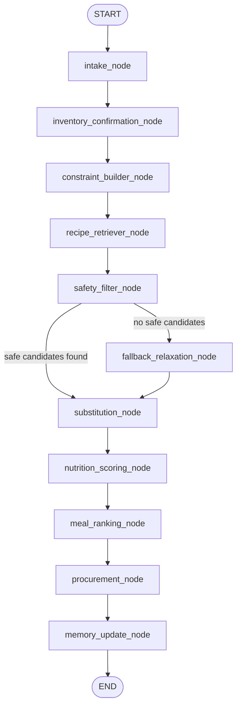

# MacroChef Agent


> **Hobby project — not medical advice.** MacroChef is an unpaid personal project,
> not a certified nutrition or allergy-safety product. Adversarial safety
> benchmark (run 2026-07-19, `20260719T115815Z`): judge-flagged inherent
> **16/259**; adjudicated-true inherent **0/259**
> (`data/evaluation/adjudication_20260719T115815Z.md`). Precautionary:
> judge-flagged **8/46**, adjudicated separately, non-gating. Judge false
> positives remain in the raw judge-flagged number permanently; the judge has
> never been modified. This benchmark measures this system's behavior on its
> own recipe corpus, not a real-world guarantee. **If you have a food
> allergy, you must independently verify every ingredient before you eat
> anything this app suggests.**

**A deterministic meal-planning and food-safety engine that uses an LLM only for the fuzzy parts.**

**🔴 Live demo:** <https://ca-macrochef.orangeplant-d8bf2180.italynorth.azurecontainerapps.io/>
(Azure Container Apps, single small always-on container — first load may take a
few seconds; anonymous per-browser sessions, per-session rate limits.)

> **The LLM never enforces your allergies and never computes your macros.
> Deterministic code does.** The model is used only for non-safety-critical work —
> parsing messy inventory text and, on request, rephrasing already-known steps
> in more detail. Anything that could harm you if it were wrong is handled by
> plain, testable Python.

Generic recipe chatbots are confident and wrong about hard constraints — they'll
happily suggest a peanut-containing "satay" to someone who told them they have a
peanut allergy. MacroChef treats meal planning as a structured decision workflow
where safety and nutrition are **not** the model's job.

> Runs with **zero API keys** in mock mode — clone and try in two commands.

---

## What this project demonstrates

I built and operate this end to end — architecture, backend, frontend, eval
methodology, and deploy pipeline. A few things worth a closer look:

- **Safety-first LLM system design.** The model is architecturally barred from
  ever deciding an allergy or nutrition outcome — every safety-relevant check
  runs through deterministic, unit-tested Python
  (`app/services/constraint_engine.py`). Not a prompt instruction; the LLM's
  output never reaches that code path at all.
- **Adversarial red-teaming with real eval discipline.** A 371-case benchmark,
  authored blind to the implementation, run deterministically (k=3, identical
  failing sets across runs). Every flagged case gets a written, per-case
  adjudication with a citable rule — and the raw judge-flagged count is
  published forever alongside the adjudicated-true count, even after the judge
  false positives are identified, because the judge itself is never modified
  to close the gap. See `data/evaluation/`.
- **Agentic workflows in production, not a demo.** Two LangGraph state
  machines (meal planner, recipe-library builder) with conditional edges,
  typed Pydantic node contracts, and a deterministic fallback runner for
  environments without LangGraph installed.
- **A solver, not an LLM guess.** The day/week planner is a from-scratch
  combinatorial search over grounded recipe macros with a pre-registered
  tolerance gate, extended with pantry-coverage and day-to-day-variety
  tiebreakers that can mathematically never override a better macro fit — see
  [Day & week planning](#day--week-planning-a-deterministic-solver) below.
- **Cost- and latency-aware LLM integration**, including the willingness to
  cut a shipped feature. An earlier version generated a live LLM "chef
  explanation" per recommended recipe; once the result set grew, that call
  started dominating request latency for a paragraph most users skimmed past.
  It was removed outright rather than kept as a sunk cost — see
  [Example response shape](#example-response-shape).
- **Full production lifecycle**, not just a notebook: FastAPI + React/
  TypeScript SPA served from one container image, GitHub Actions CI gating
  every push on both backend and frontend suites, a human-approved manual
  promotion to Azure Container Apps, anonymous session auth with per-session
  rate limiting, and 1,285 backend + 98 frontend automated tests.
- **A documented, reviewed AI-agent-assisted engineering process.** Changes to
  anything allergy- or diet-adjacent go through a mandatory design consult and
  a mandatory independent review before they ship — the same discipline you'd
  want on a team, made explicit and checked into the repo (`CLAUDE.md`).

A JD-requirement-to-code mapping lives in `docs/SKILLS_MATRIX.md` for anyone
doing a closer technical read.

---

## Why this is different

| Concern | Who decides in a generic LLM chatbot | Who decides in MacroChef |
|---|---|---|
| Is this recipe safe for my allergy? | The LLM (fuzzy, can hallucinate) | **Deterministic code** — `app/services/constraint_engine.py` |
| What are the macros? | The LLM / recipe self-reported tags | **Deterministic scorer** — `app/services/nutrition_scorer.py` |
| Which recipes match my pantry & diet? | The LLM | **Deterministic filter + scorer** |
| Parse "chikcen brest, spinch" into ingredients | — | LLM / fuzzy normalizer (safe to be wrong; user confirms) |
| Rank the shortlist | — | Deterministic (pantry-first, then macro/time/preference) |
| Elaborate a recipe's steps, on request | — | LLM (phrasing only — cannot add/remove an ingredient or state a nutrition/allergy fact) |

Allergies, disliked ingredients, diet type, and maximum cook time are enforced as
**hard constraints** in `constraint_engine.py`. Macro fit is computed
deterministically by the scorer. The LLM cannot override a safety decision — by
construction, not by prompt. Macro targets are *soft* constraints used only to
rank, never to include or exclude on safety grounds.

> A reproducible adversarial safety benchmark (371 frozen cases, authored blind
> to the implementation: allergy-contradiction traps, hidden allergens like
> "satay sauce" → peanut, diet-type traps, and more) is run against MacroChef
> with `python scripts/run_safety_benchmark.py`, k=3, deterministic. On the
> current corpus (re-imported from a richer scraped-archive source, task A1,
> 2026-07-19), the 259 release-blocking (`inherent`-severity) cases: the
> deterministic judge flagged **16/259**; written per-case adjudication
> (advisor-reviewed, `data/evaluation/adjudication_20260719T115815Z.md`)
> found **0/259 true violations**. The re-verification found and cured one
> genuine gap along the way (a Kellogg's Rice Krispies serving undetectable
> by the pre-fix gluten vocabulary — see
> `data/evaluation/adjudication_20260719T083748Z.md` and
> `docs/BACKLOG.md`'s A1 entries for the full writeup) before landing at
> 0/259 true on the cured corpus.
>
> **Methodology:** the 371 cases are frozen and were authored before any
> adjudication; runs are executed k=3 with identical failing sets across runs
> (deterministic); every judge flag receives a written, per-case,
> advisor-reviewed adjudication (verdict `TRUE_VIOLATION` or `JUDGE_FP`, with
> matched term + field, the served recipe's actual ingredients, and a citable
> rule — ambiguity defaults to `TRUE_VIOLATION`). Judge false positives stay
> in the raw judge-flagged number permanently — the judge itself is never
> modified to close the gap, and both numbers are always published together,
> never a bare "0 violations" claim. See the adjudication files under
> `data/evaluation/` (methodology convention set in
> `adjudication_20260717T145539Z.md`; current gate-deciding run in
> `adjudication_20260719T115815Z.md`).
>
> The benchmark also includes a **precautionary** (non-blocking, "may-contain"
> class) partition of 46 cases — judge-flagged **8/46**, adjudicated
> separately and non-gating — and a **safe-control** partition of 60 cases
> used to measure over-blocking, which stayed at **0/60** (no safe recipe was
> incorrectly rejected). The planned comparison vs. direct LLM prompting is
> deferred (see `docs/BACKLOG.md`). See `docs/ROADMAP.md`.

---

## Quickstart

Requires Python 3.11+ and Node 22+.

```bash
# 1. Clone
git clone https://github.com/Dipesh-Lc/macroChef-agent.git
cd macroChef-agent

# 2. Install
python -m venv .venv
source .venv/bin/activate            # Windows: .venv\Scripts\activate
pip install -r requirements.txt

# 3. Configure (mock mode — no API keys needed)
cp .env.example .env

# 4. Build the recipe index (full grounded corpus: 25 curated seeds +
#    imported Food.com recipes, ~3,900 recipes)
python scripts/ingest_recipes.py

# 5. Run the API and the SPA (two terminals)
uvicorn app.main:app --reload --port 8000
cd web && npm install && npm run dev
```

Then open the Vite dev server's URL, **http://localhost:5173** (it proxies
the backend API prefixes to `:8000` — see `web/vite.config.ts`).

The default `.env` uses mock/local mode and requires no external API keys.

### One-command local run (Docker, API only)

If you have Docker, this runs the FastAPI/uvicorn API in a container with
live code reload off the host bind mount:

```bash
docker compose up --build
```

- API: http://localhost:8000  (health check: `GET /health`)

This mode is JSON-API-only, not the SPA — the bind-mounted host `web/`
directory hides whatever `web/dist` the image itself baked in, and a fresh
checkout has no local `web/dist` build. Use the two-terminal flow above for
the full app locally. The production image (built without a bind mount)
serves both the API and the SPA from one process — see `docs/DEPLOY.md`.
Deploying to Azure Container Apps is automated (CI/CD, manual production
trigger) — also `docs/DEPLOY.md`.

---

## Screenshots & demo

> **TODO:** Add screenshots to `assets/screenshots/` and a demo clip, then replace the placeholders below.

- **TODO** `assets/screenshots/recommendations.png` — a recipe card in its
  default summary state (name, macros, pantry-match chips, ingredients) with
  "Show score details" expanded
- **TODO** `assets/screenshots/day-plan.png` — the Day planner: macro targets
  in, an assembled plan out
- **TODO** `assets/screenshots/library.png` — My Recipes / the Recipe Library
  Builder's candidate-review view
- **TODO** demo GIF/clip (60–90s) — end-to-end: pantry in → safe, macro-aware
  plan out → "Get detailed instructions" on one card

---

## How it works

MacroChef is a LangGraph workflow. Each node has structured Pydantic v2
inputs/outputs, and the safety-critical nodes are pure deterministic code.



The graph handles conditional paths for empty inventory, low-confidence vision
items, retrieval fallback when ChromaDB is unavailable, and no valid recipes
surviving the safety filter.

### Architecture

```text
React SPA (web/, served same-origin by FastAPI in production)
   |
   v
FastAPI routes
   |
   v
LangGraph workflow
   |--> inventory parser (+ optional fuzzy normalization)
   |--> inventory confirmation
   |--> constraint builder
   |--> ChromaDB recipe retriever + keyword fallback
   |--> deterministic safety filter                 <-- LLM never touches this
   |--> deterministic substitution engine (safe ingredient swaps)
   |--> deterministic pantry-first ranking           <-- LLM never touches this
   |--> shopping list generation
   |--> SQLite memory

Separately, on demand: "Get detailed instructions" rewrites a recipe's
existing steps into a beginner-friendly walkthrough via the same
multi-provider LLM chain used elsewhere -- constrained to elaborate only,
never to add/remove an ingredient or state a nutrition/allergy fact.
```

### RAG design

`scripts/ingest_recipes.py` does a clean rebuild of the full recipe corpus
(`data/processed/sample_recipes.jsonl` + `data/processed/imported_recipes.jsonl`,
grounded against USDA FoodData Central), builds a rich recipe document per
recipe, stores recipe metadata, and persists the Chroma collection in
`data/chroma`. Local sentence-transformers embeddings are attempted first; a
deterministic hashing-embedding fallback keeps offline demos runnable.

Beyond the 25 hand-curated seed recipes, the corpus also includes recipes
imported via `scripts/import_corpus.py` into `data/processed/imported_recipes.jsonl`
(kept separate from the seed file, unioned at index time). Recipe data derived
from a public Kaggle dataset sourced from Food.com
([irkaal/foodcom-recipes-and-reviews](https://www.kaggle.com/datasets/irkaal/foodcom-recipes-and-reviews),
CC0).

---

## Features

- Text inventory parsing with optional fuzzy ingredient normalization
  (`chikcen brest` → `chicken breast` when `rapidfuzz` is installed)
- ChromaDB RAG over the recipe corpus, with a keyword-search fallback
- LangGraph nodes for intake, inventory confirmation, constraints, retrieval,
  safety filtering, safe substitution, scoring, ranking, procurement, and memory
- **Deterministic** hard constraints for allergies, dislikes, diet type, and cook time
- **Deterministic** pantry-first ranking: recipes are sorted primarily by how
  much of the pantry they use (bucketed), with macro fit, cook time, and
  cuisine preference only breaking ties within a bucket
- Quick macro-target presets ("High Protein," "High Fibre") on top of
  individually toggleable calorie/protein/carb/fat/fiber targets
- On-demand, constrained LLM elaboration of a recipe's instructions
  ("Get detailed instructions") — never changes ingredients or amounts, never
  states a nutrition or allergy fact
- Separate Recipe Library Builder agent for discovering, validating, saving,
  and indexing personal recipes
- Structured Pydantic v2 API contracts, generated into TypeScript on the frontend
- Anonymous, HttpOnly-cookie session auth with per-session rate limiting
- SQLite user-feedback memory
- React SPA frontend with recipe cards, shopping list, and a debug trace panel
- 1,285 backend (pytest) + 98 frontend (Vitest) automated tests covering
  parsing, constraints, scoring, retrieval, planners, and graph flow

### Optional / experimental: fridge-photo (vision) inventory

The feature is **off by default** and gated by `MACROCHEF_ENABLE_VISION` (set to
`true` in your `.env` to enable it). Even when enabled, extraction is
deterministic mock unless a real `MODEL_PROVIDER` with credentials is also
configured (see *Optional model providers* below).

When enabled, the frontend accepts an optional fridge/pantry image alongside typed
inventory and merges both into one editable table. Vision is intentionally isolated:
it never influences allergy or nutrition decisions, and detected items are surfaced
for user confirmation (anything below a confidence threshold is flagged
`needs_confirmation`). Treat it as experimental.

---

## Day & week planning: a deterministic solver

Given calorie/protein/carb/fat/fiber targets, `app/services/day_planner.py`
searches recipe-serving combinations from the nutrition-grounded corpus and
returns the one whose total macros fit a pre-registered tolerance (kcal within
10%, protein within 15%) — a small, from-scratch combinatorial solver over the
trusted candidate pool, not an LLM guess, and strictly downstream of the same
safety filter as the rest of the app.

`app/services/weekly_planner.py` composes this across a week, adding two
strict tiebreakers on top of the macro-fit gate: pantry-mass coverage and
day-to-day recipe variety (avoiding repeats across the week when an equally
macro-fit alternative exists). Both are appended *below* the macro-fit sort
key in the scoring function, so neither can ever promote a worse-fitting plan
— provably, by construction. This design went through two independent rounds
of architecture review (a fresh design consult plus a mandatory post-
implementation review) before shipping, because it revisited an
already-locked algorithm; the full paper trail is in `docs/BACKLOG.md`.

---

## Recipe Library Builder Agent

The Recipe Library Builder is a separate acquisition workflow. The meal planner
answers "Given my pantry and constraints, what should I cook?" The library builder
answers "Help me build a personalized recipe database."

```text
My Recipes page (web/src/pages/MyRecipesPage.tsx)
  -> POST /library/discover  -> discovery_node -> normalization_node
  -> recipe_validation_node  -> deduplication_node -> candidate_presentation_node
  -> POST /library/save      -> SQLite structured recipe store -> ChromaDB index
```

Users choose cuisines, meal type, diet type, cook time, difficulty, allergy
exclusions, and preferences such as "minimal equipment" or "no deep frying."
Candidate recipes are validated and deduplicated before they can be saved. Saved
recipes store `owner_user_id`, `is_user_saved`, source metadata, placeholder image
URLs, estimated macros, and allergen tags. The recommendation workflow retrieves
from both the base corpus and the current user's saved library; private recipes
are filtered by `user_id` so one user's recipes are never returned for another.

Recipe Library API endpoints:

- `POST /library/discover` — generate or retrieve candidate recipes
- `POST /library/save` — save selected validated candidates
- `GET /library/{user_id}` — list saved recipes
- `DELETE /library/{user_id}/{recipe_id}` — deactivate a saved recipe
- `POST /library/reindex` — rebuild Chroma from base and user recipes

---

## Safety Tools API

A small, standalone HTTP surface (`app/api/routes_safety_tools.py`) that
exposes the deterministic constraint engine directly — for an external AI
agent or developer who wants allergy/diet-type filtering without going
through MacroChef's full recommend/day-plan pipeline. Every endpoint below
is a thin, unmodified pass-through to the same
`app/services/constraint_engine.py` functions the rest of the app uses —
this surface adds no new safety logic of its own, only new access to logic
that was already there. Rate-limited by caller IP (not a session token —
see `docs/BACKLOG.md`'s "Safety-tools API / MCP" entry for why this differs
from `/library`'s session-keyed limits), default 60 requests/hour/caller
(`RATE_LIMIT_SAFETY_TOOLS_MAX`).

- `POST /tools/validate-recipe` — `{recipe, user_profile}` → the same
  `ValidationResult` (`is_valid`, `rejection_reason`) `validate_recipe`
  returns (allergens, disliked ingredients, diet type, cook time, in that
  order)
- `POST /tools/check-allergen` — `{recipe, allergies}` →
  `{contains_allergen: bool}`
- `POST /tools/check-diet-violation` — `{recipe, diet_type}` →
  `{violates_diet_type: bool}` (422 for a `diet_type` outside
  `vegetarian`/`vegan`/`gluten-free`/`dairy-free` — this project doesn't
  enforce, and won't silently pass, an unsupported diet type)
- `POST /tools/derive-allergen-labels` — `{ingredient_names: [str, ...]}` →
  `{allergens: [str, ...]}`

Same disclaimer as the rest of this project: hobby project, not medical
advice — see the adversarial-benchmark numbers at the top of this README
(judge-flagged / adjudicated-true, published together, always).

---

## Optional model providers

Mock mode is the default and needs no keys. If you provide API keys or run Ollama
locally, MacroChef can use hosted or local models for the fuzzy work only (image
inventory extraction and on-demand instruction elaboration) — never for safety or
nutrition.

Supported provider names:

- `mock` — deterministic demo mode, no API key
- `gemini` / `google` — Gemini API via `GEMINI_API_KEY` or `GOOGLE_API_KEY`
- `openai` — OpenAI API via `OPENAI_API_KEY`
- `anthropic` / `claude` — Claude API via `ANTHROPIC_API_KEY` or `CLAUDE_API_KEY`
- `ollama` / `local` — local Ollama server via `OLLAMA_BASE_URL`

`MODEL_PROVIDER` is the primary provider; `MODEL_PROVIDER_FALLBACKS` is an ordered
comma-separated list. If the primary provider is missing credentials, unavailable,
or returns invalid output, MacroChef tries each fallback and finally falls back to
`mock`, so the app always stays runnable. See `.env.example` for every supported
key.

---

## Example request

```bash
curl -X POST http://localhost:8000/recipes/recommend \
  -H "Content-Type: application/json" \
  -d '{
    "user_id": "demo_user",
    "input_type": "text",
    "typed_ingredients": "chicken breast, spinach, rice",
    "user_profile": {
      "user_id": "demo_user",
      "allergies": ["peanut"],
      "disliked_ingredients": [],
      "diet_type": null,
      "preferred_cuisines": ["Mediterranean"],
      "macro_targets": {
        "calories": 600, "protein_g": 45, "carbs_g": 60, "fat_g": 20, "fiber_g": 8
      },
      "max_cook_time_min": 35
    },
    "cuisine_preference": "Mediterranean",
    "meal_type": "dinner"
  }'
```

<details>
<summary>Windows PowerShell version</summary>

```powershell
$body = @'
{
  "user_id": "demo_user",
  "input_type": "text",
  "typed_ingredients": "chicken breast, spinach, rice",
  "user_profile": {
    "user_id": "demo_user",
    "allergies": ["peanut"],
    "disliked_ingredients": [],
    "diet_type": null,
    "preferred_cuisines": ["Mediterranean"],
    "macro_targets": { "calories": 600, "protein_g": 45, "carbs_g": 60, "fat_g": 20, "fiber_g": 8 },
    "max_cook_time_min": 35
  },
  "cuisine_preference": "Mediterranean",
  "meal_type": "dinner"
}
'@

Invoke-RestMethod -Uri "http://localhost:8000/recipes/recommend" -Method Post -ContentType "application/json" -Body $body
```

</details>

### Example response shape

```json
{
  "recommendations": [
    {
      "recipe": {"recipe_id": "r_001", "title": "Mediterranean Chicken Rice Bowl"},
      "score": {
        "pantry_match_score": 0.5,
        "macro_fit_score": 0.91,
        "final_score": 0.72,
        "missing_ingredients": ["bell pepper", "Greek yogurt", "lemon"]
      },
      "explanation": "",
      "shopping_list": ["bell pepper", "Greek yogurt", "lemon"]
    }
  ],
  "shopping_list": [{"name": "bell pepper", "reason": "Needed for ..."}],
  "rejected_recipes": [],
  "debug_trace": ["intake_node: extracted 3 ingredients.", "..."]
}
```

`explanation` stays on the wire contract but is intentionally always empty:
an earlier version populated it with a live per-recipe LLM paragraph, which
was removed once profiling showed it dominated request latency as the result
set grew, for a paragraph most users skimmed past — see
[What this project demonstrates](#what-this-project-demonstrates).

---

## Evaluation

Deterministic metrics computed over a small internal demo set (not the
adversarial safety benchmark — see the disclaimer at the top of this README):

- Allergy violation rate (release-blocking gate: must be 0 on this demo set)
- Pantry utilization rate
- Macro deviation
- Missing ingredient count
- Recommendation validity rate

```bash
python scripts/evaluate_demo_set.py
```

## Tests

```bash
pytest                              # 1,285 backend tests
cd web && npm run test -- --run     # 98 frontend tests
```

Both suites gate every push in CI (`.github/workflows/ci.yml`: `test` + `web`
jobs); a manual `workflow_dispatch` on `main` (human-triggered) is the only
path to production.

## Tech stack

- Backend: FastAPI, Pydantic v2, Uvicorn, SQLAlchemy, SQLite
- Frontend: React, TypeScript, Vite, TanStack Query, Tailwind CSS
- Agent: LangGraph
- RAG: ChromaDB, sentence-transformers, deterministic embedding fallback
- Optional AI providers: Gemini, OpenAI, Claude, local Ollama
- Testing: Pytest (backend), Vitest + Testing Library + ESLint + tsc (frontend)
- Packaging & CI/CD: Docker, docker-compose, GitHub Actions, Azure Container Apps

## Limitations

- Not medical advice.
- Nutrition is grounded via USDA FoodData Central for the 25 hand-authored seed
  recipes; imported-corpus rows remain ungrounded (USDA linkage is a separate,
  not-yet-run pipeline stage — see `app/services/grounding_job.py`) even
  though most of them now carry real units (see below).
- The bundled recipe dataset is intentionally small for an MVP.
- **Day/week planning draws from a small nutrition-grounded "trusted" pool**
  (only ~15 of the corpus's ~3,900 recipes have USDA-grounded per-serving
  macros — everything else is silently excluded from that solver's candidate
  set). The pantry and day-to-day-variety tiebreakers described above are
  real, but at this pool size an exact macro-fit tie for them to break on is
  rare; they were built ahead of a pre-registered ~200-recipe revisit
  trigger, at an explicit accepted tradeoff (see `docs/BACKLOG.md`).
- Vision extraction is deterministic mock by default and is not a real image
  recognizer.
- Allergy safety depends on accurate recipe metadata and accurate user input.
- Optional hosted/local model integrations are isolated and disabled by default,
  and are never treated as allergy or nutrition authorities.
- **Imported corpus quantities now mostly carry real units.** As of the
  2026-07-19 migration off the original Kaggle CSV onto a per-recipe scraped
  archive of the original Food.com pages (`data/scraped/foodcom/*.md`,
  `scripts/import_corpus.py --dataset foodcom_scraped_archive`), **76.14%**
  of imported ingredient rows (30,780 of 40,423) carry a real amount + unit,
  up from 0.35% (124 of ~35,183) under the old CSV import, which had
  stripped units from its ingredient columns. Imported recipes are still not
  USDA-nutrition-grounded (a separate step), but quantity-aware features
  (pantry-match amounts, shopping-list math) are now real for most imported
  rows, not just the 25 hand-authored seed recipes. Allergen detection is
  name-based and was unaffected either way.
- **Imported corpus size reflects a deterministic integrity quarantine.** The
  imported Food.com corpus is **3,853 rows** (as of the 2026-07-19
  scraped-archive migration + diet_023 cure round), with **379 rows**
  quarantined by the same deterministic title/instructions-vs-ingredients
  integrity checks plus a small number of individually-reviewed manual
  quarantines — a corruption/gap class that could otherwise let an allergen
  slip past the safety filter undetected. The migration re-ran both
  automated checks against the richer original-page text for every one of
  the ~4,235 recoverable recipes: 984 of the previously-quarantined 1,354
  rows were released back to active (their defect was cured by the more
  complete source text — see `docs/BACKLOG.md`'s A1 entries and
  `data/processed/quarantine_history/manual_release_adjudication_*.md` for
  the human-reviewed subset), and 5 previously-active rows were newly
  quarantined by the automated checks. A further 6 rows were manually
  quarantined during the diet_023 safety-benchmark cure (brand-cereal
  ingredients like bare "corn flakes" that a vocabulary fix couldn't reach
  automatically — see `docs/BACKLOG.md`). 3 ids from the original corpus
  have no recoverable archive page (persistent HTTP 500) and were dropped
  entirely. See
  `docs/instructions_integrity_spec.md` for the checks' rules and residual
  known limitations.
- **A small number of diet-type checks intentionally over-block, by design.**
  Recipes containing coconut milk or peanut butter are currently unservable
  under `dairy-free`/`vegan` diet requests even though coconut milk and peanut
  butter contain no dairy — the diet-exclusion path fails closed on the
  substring "milk"/"butter" rather than risk a lookalike carve-out that could
  also weaken the allergy-safety path (which shares the same matching code).
  This is an accepted, deliberate tradeoff (favoring false rejections over any
  risk of false admits); see `docs/BACKLOG.md` for the tracked fix.
- **Identity is anonymous and per-browser.** Sessions are signed anonymous
  tokens — no email, no login (a deliberate scope decision: no PII in a hobby
  demo). Clearing cookies or switching devices starts a fresh library; tokens
  expire after 30 days and the old library is then unreachable. Session
  isolation itself is enforced and tested (tampered/forged/expired tokens get
  401). Durable cross-device identity (magic-link) is a possible post-launch
  addition.

## Roadmap

MacroChef is being upgraded in phases toward a grounded nutrition database,
quantity/unit-aware inventory, a published safety benchmark, and a weekly meal
planner. See `docs/ROADMAP.md`.
